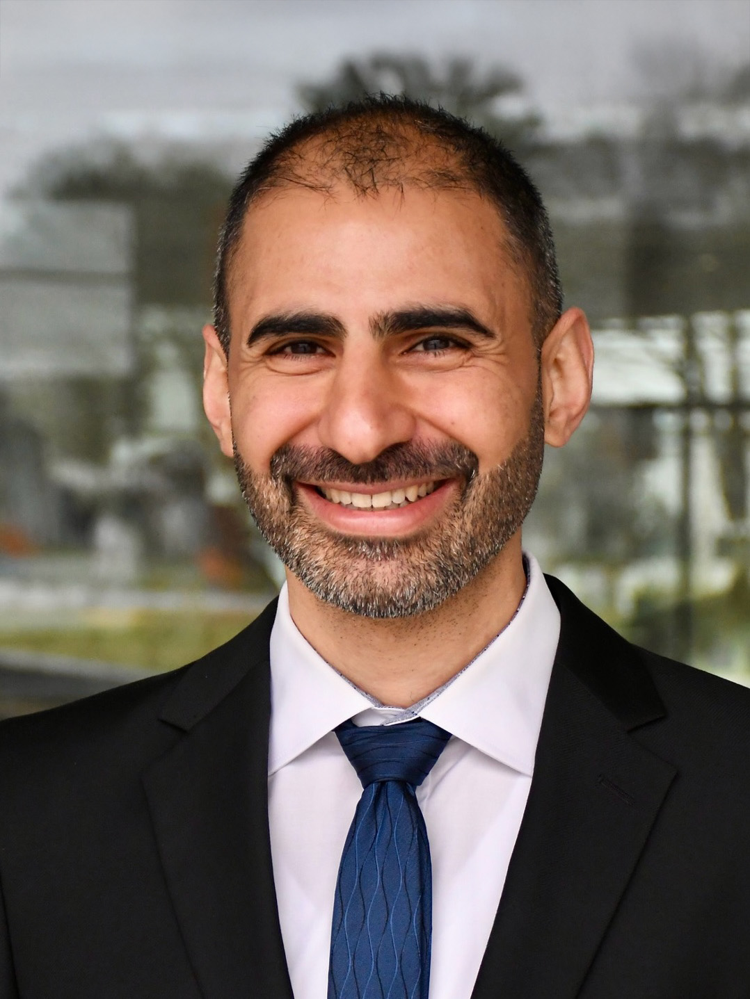
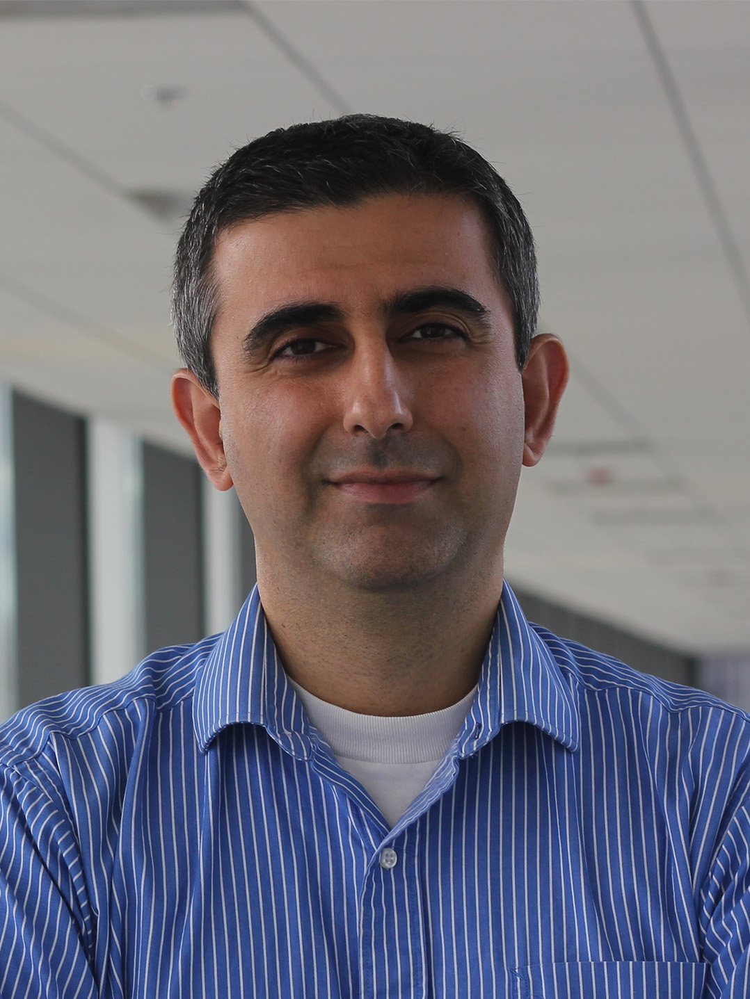

:notoc: true

.. _about:

The Organisers
===============

The **IPerSense Workshop Series** is organised by an international committee of researchers 
working on **infrastructure-based and integrated perception systems** for intelligent mobility.

	Copyright © RWTH Aachen University

**Email:** schaefer@embedded.rwth-aachen.de

**Simon Schäfer** earned his B.Sc. and M.Sc. degrees in Computational Engineering
Science from RWTH Aachen University, Germany. He is currently a Research
Associate at the Chair for Embedded Software at RWTH Aachen University, where
he conducts research within the Collaborative Research Center Transregio 339
(DFG), which develops a digital twin of the road infrastructure. His work
focuses on infrastructure-based localization of traffic participants and
multi-sensor fusion for connected and automated vehicles. He is expected to
complete his Ph.D. in the field of infrastructure-based localization in
mid-2026.

Since 2024, he has served as Project Leader of the Cyber-Physical Mobility
(CPM) Lab, a small-scale connected and automated vehicle (CAV) testbed for
cooperative perception, planning, and control. In this role, he coordinates
research activities, advances the system architecture, and supports
experimental validation of cooperative driving concepts. In 2024, he was a
Visiting Researcher at the University of Alberta in Edmonton, Canada. He holds
Graduate Student Member status at IEEE.

Learn more about `Simon Schäfer <https://www.embedded.rwth-aachen.de/cms/embedded/der-lehrstuhl/mitarbeiteruebersicht/~bfleef/simon-schaefer/>`_.

	Copyright © University of the Bundeswehr Munich

**Email:** bassam.alrifaee@unibw.de

Dr. **Bassam Alrifaee** is a Professor in the Department of Aerospace Engineering
and Director of the Professorship for Adaptive Behavior of Autonomous Vehicles
at the University of the Bundeswehr Munich. Prior to this, he served as a
Senior Researcher and Lecturer and was the founding director of the
Cyber-Physical Mobility (CPM) group and CPM Lab at RWTH Aachen University,
Germany (2017-2024). He held a Visiting Scholar position at the University of
Delaware, USA, in 2023.

Prof. Alrifaee received his Ph.D. from RWTH in 2017. His research focuses on
distributed predictive control, service-oriented architectures for control
systems, and their applications in connected and automated vehicles. Prof.
Alrifaee has secured grants from various institutions and received awards for
his advisory and editorial contributions. He holds Senior Member status at
IEEE.

Learn more about `Bassam Alrifaee <https://www.unibw.de/home-en/appointment-of-professors/prof-bassam-alrifaee>`_.

	Copyright © Technische Hochschule Ingolstadt

**Email:** ignacio.alvarez@thi.de

Dr. **Ignacio Alvarez** has held the Bavarian Top Professorship for Human-Centered
Intelligent Systems at Technische Hochschule Ingolstadt (THI) since 2025,
where he leads research on AI-driven mobility with a focus on automated
driving, safety, human-AI collaboration, and in-vehicle user experience. His
work spans formal methods, artificial intelligence, autonomous systems, and
human-centered design within intelligent transport systems.

Before joining THI, he served as Principal Engineer and Executive Technical
Advisor at Intel Labs (2021-2025) and Senior Research Scientist and Autonomous
Driving Lead at Intel Labs (2014-2021), driving global R&D and strategy in
autonomous driving and AI. Earlier, he was Senior IT Manager and Connected
Drive Lead at BMW (2012-2014) and held advanced research roles with BMW and
Clemson University (2009-2012). He earned his Ph.D. in Computer Science
(Automotive Intelligent Systems) in 2012 from the University of the Basque
Country (Spain) and Clemson University (USA), graduating summa cum laude. He
holds Senior Member status at IEEE and is a board member of professional
societies in intelligent transportation and HCI.

Learn more about `Ignacio Alvarez <https://ignacioalvmar.com>`_.

	Copyright © University of Alberta

**Email:** ehashemi@ualberta.ca

Dr. **Ehsan Hashemi** is an Associate Professor in the Department of Mechanical
Engineering at the University of Alberta (since 2021). He earned his PhD in
Mechanical and Mechatronics Engineering from the University of Waterloo
(Canada). Dr. Hashemi was a Research Assistant Professor at the University of
Waterloo, a Visiting Professor at the School of Electrical Engineering and
Computer Science at KTH Royal Institute of Technology (Sweden), the General
Chair of the IEEE ITS Conference 2024 in Edmonton, Program Committee member
for the American Control Conference (ACC) 2024, and Publication Co-Chair of
IEEE Conference on Biomedical Robotics and Biomechatronics (BioRob 2026).

He has led large- and small-scale projects with Canadian and international
industry partners on autonomous navigation, networked control systems, robot
perception, and explainable AI with several technology transfers. Dr. Hashemi
is an IEEE Senior Member and Technical Committee member for the IEEE Control
Systems Society. His current research programs focus on cyber-physical
systems, distributed estimation and diagnosis, robot learning, control theory,
and human perception.

Learn more about `Ehsan Hashemi <https://sites.google.com/ualberta.ca/networked-optimization-diagnos/team>`_.

