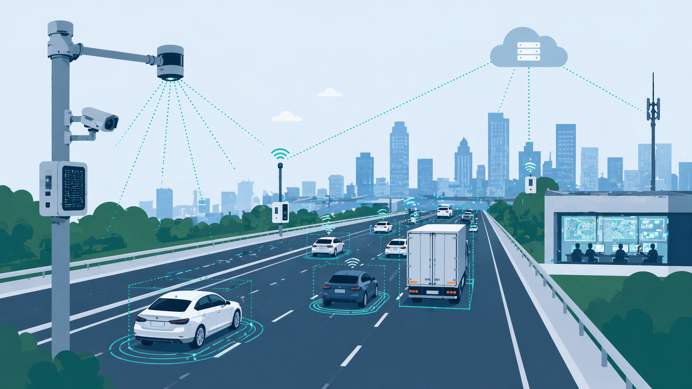

.. _index:

IPerSense Workshop Series
=========================

   Infrastructure, perception, and sensing for connected mobility

The **IPerSense Workshop Series** hosts focused, community-driven workshops on
infrastructure-based and integrated perception systems for intelligent mobility.

The current edition, :doc:`workshops/itsc_2026`, focuses on roadside sensing,
in-road sensing, distributed sensor fusion, uncertainty-aware estimation, and
digital twins for traffic infrastructure.

Why IPerSense
-------------

**IPerSense** stands for **Infrastructure Perception and Sensing**. The name
reflects the workshop's focus on how infrastructure can extend the sensing
horizon of connected and automated vehicles.

The workshop connects research on roadside sensor systems, in-road sensing,
cooperative perception, and validation across simulation, small-scale
testbeds, and real deployments.

It is designed as a focused venue for researchers working on sensing
technologies, deployment questions, and scalable system integration in
intelligent transportation.

Learn more about the organisers and the motivation behind the workshop on the :doc:`about` page.

News
----

.. admonition:: 2026-04-20 — ITSC 2026 workshop accepted
   :class: tip

   The **IPerSense** workshop proposal for **IEEE ITSC 2026** has been
   accepted. This page will be updated as the organiser team finalises speakers,
   programme, and participation details.

.. admonition:: 2026-02-15 — Workshop organiser team finalised
   :class: note

   The organiser team for the **IPerSense** workshop on **Infrastructure-based
   Perception Systems** has been finalised. Detailed information about the
   organisers is listed on :doc:`about`.
   
.. admonition:: 2026-01-10 — Workshop series launched
   :class: note

   The **IPerSense Workshop Series** has been launched.

.. toctree::
   :maxdepth: 2
   :hidden:

   workshops/workshops
   about